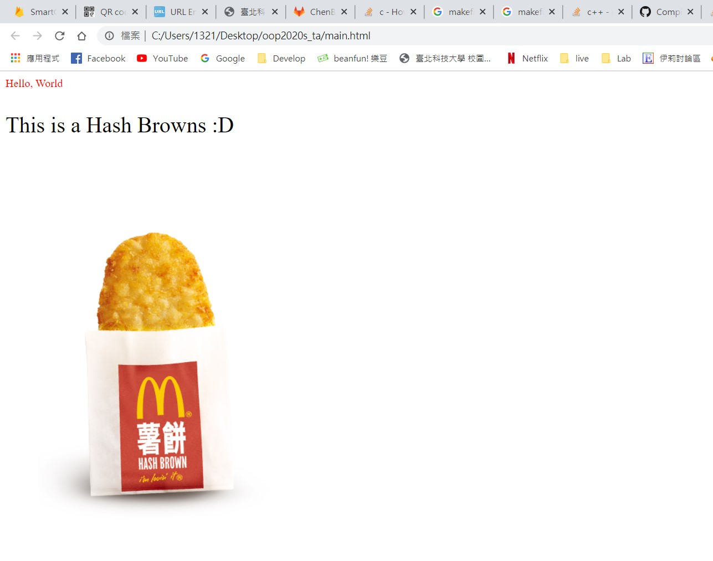

# OOP with C++ (and more)
#### Spring, 2020
#### Prof Y C Cheng
#### Dept of Computer Science and Information Engineering
#### Taipei Tech

## Assignment 8

### Due: 11:59 p.m., 3 June 2020


**For this assignment, please put base class Tag in src/tag.h. Test class Image in test/ut_image.h, test class text in test/ut_text.h. You will have 3 output files: bin/ut_all for all testing, bin/ui_main for ui executable and main.html is your ui output product**


### Purpose of this assignment:
Constructing UI framework from the scratch by using html

### Problems:
In homework 4, we implement the basic \<p\> and \ without inheritance, in consequence, your program must to specify the output order. In this assignment, we implement these two class in polymorphic way to free the output order of html.

Please implement or modify these class and methods:

- class Html
- class Text
- class Image
- class Tag
- Tag.Tag()
- Tag.Tag(std::string id)
- Tag.getId()
- Html.appendTag(Tag \*child)
- Html.render()
-	Text.Text()
- Text.Text(std::string id)
- Text.render()
- Text.setColor(std::string color)
- Text.setFontSize(std::string fontSize)
- Text.setText(std::strgin content)
- Image.Image()
- Image.Image(std::string id)
- Image.render()
- Image.setSrc(std::string imageSrc)
- Image.setPosition(std::string top, std::string left)

### Design concept:

This UI framework is capable of adding multiple child tag (i.e. text, image) to the body of html, and output with proper html tag format. The following is an example:

main.cpp
```c++
#include<iostream>

#include "./html.h"
#include "./text.h"
#include "./image.h"

int main(){
  Html h;
  Text t1;
  Text t2;
  Image i;
  t1.setText("Hello, World");
  t1.setColor("#FF0800");
  t2.setText("This is a Hash Browns :D");
  t2.setFontSize("32px");
  i.setSrc("Hash Browns.png");
  i.setPosition("200px","0px");
  h.appendTag(&t1);
  h.appendTag(&t2);
  h.appendTag(&i);
  h.outputHtml();
  std::cout << "output successful" << std::endl;
  return 0;
}
```

main.html (輸出成一行即可，這邊換行是幫助閱讀)
```html
<HTML>
  <body>
    <p id='' style='color:#FF0800;font-size:16px;'>Hello, World</p>
    <p id='' style='color:#000000;font-size:32px;'>This is a Hash Browns :D</p>
    
  </body>
</HTML>
```



### Default style of tags:
**text**
- \<p id='' style='color:#000000;font-size:16px;'>\</p>

**image**
- \


### Grading standard:
Tag.Tag()
- default constructor, which have to empty the attribute 'id'.(5%)

Tag.Tag(std::string id)
- constructor, which have to specify the attribute 'id'.(5%)

Tag.getId()
-	get the id of tag.(5%)

Html.appendTag(Tag \*child)
- add a tag into \<html>.(5%)

Html.render()
- return the content with proper \<html>, \<body> tag pair.(5%)
- return the empty body if no child append.(5%)

Html.outputHtml()
- grading by your output of src/main.cpp, should appear like example.(5%)

Text.Text()
- the default constructor, which have to call the default constructor of parent class Tag.(5%)

Text.Text(std::string id)
- constructor, which have to call the constructor of parent class Tag(5%)

Text.render()
- return \<p> tag pair with specified content.(5%)
- return an empty \<p> tag if content is not set.(5%)

Text.setColor(std::string color)
- set the color of tag \<p>.(5%)

Text.setFontSize(std::string fontSize)
- set the size of tag \<p>.(5%)

Text.setText(std::string content)
- set the content of tag \<p>.(5%)

Image.Image()
- the default constructor, which have to call the default constructor of parent class Tag.(5%)

Image.Image(std::string id)
- constructor, which have to call the consturctor of parent class Tag(5%)

Image.render()
- return \ tag with specified imageSrc properly.(5%)
- return an empty \ tag if imageSrc is not set.(5%)

Image.setSrc(std::string imageSrc)
- set the source of tag \.(5%)

Image.setPosition(std::string top, std::string left)
- set the position of tag \.(5%)


### Sample code:
We will provide sample code for this assignment.

**src/tag.h**
```c++
#ifndef TAG_H
#define TAG_H

#include <cstring>

class Tag{
public:
  virtual std::string render() const = 0;

  Tag(){...}

  Tag(std::string id){...}

  std::string getId() const{...}

private:
  std::string id; // the variable must be set to private

};

#endif
```


**src/html.h**
```c++
#ifndef HTML_H
#define HTML_H

#include "tag.h"

#include<fstream>
#include<cstring>
#include<vector>

class Html{
public:
  void appendTag(Tag *child){...}

  std::string render(){...}

  void outputHtml(){
     std::ofstream file;
     file.open("main.html");
     file << this->render();
     file.close();
  }

private:
  std::vector<Tag*> tags;
  const std::string html_head="<HTML><body>";
  const std::string html_end="</body></HTML>";
};

#endif
```


**src/text.h**
```c++
#ifndef TEXT_H
#define TEXT_H

#include "tag.h"

class Text{
public:
  Text(){...}

  Text(std::string id){...}

  std::string render() const override{...}

  void setColor(std::string color){...}

  void setFontSize(std::string fontSize){...}

  void setText(std::string content){...}

private:
  std::string content;
  std::string color;
  std::string fontSize;
};

#endif
```


**src/image.h**
```c++
#ifndef IMAGE_H
#define IMAGE_H

#include "tag.h"

class Image : public Tag{
public:
  Image(){...}

  Image(std::string id){...}

  std::string render() const override{...}

  void setPosition(std::string top, std::string left){...}

  void setSrc(std::string imageSrc){...}

private:
  std::string imageSrc;
  std::string top;
  std::string left;
};

#endif

```


**src/main.cpp**
```c++
#include<iostream>

#include "./html.h"
#include "./text.h"
#include "./image.h"
//don't modify
int main(){
  Html h;
  Text t1;
  Text t2;
  Image i;
  t1.setText("Hello, World");
  t1.setColor("#FF0800");
  t2.setText("This is a Hash Browns :D");
  t2.setFontSize("32px");
  i.setSrc("Hash Browns.png");
  i.setPosition("200px","0px");
  h.appendText(t1);
  h.appendText(t2);
  h.appendImage(i);
  h.outputHtml();
  std::cout << "output successful" << std::endl;
  return 0;
}
```


**test/ut_main.cpp**
```c++
#include <gtest/gtest.h>

#include "./ut_html.h"
#include "./ut_text.h"
#include "./ut_image.h"

int main(int argc, char **argv){
  testing::InitGoogleTest(&argc, argv);
  return RUN_ALL_TESTS();
}
```


**test/ut_html.h**
```c++
#include "../src/html.h"
#include "../src/text.h"
#include "../src/image.h"

// add your test here...
```


**test/ut_text.h**
```c++
#include "../src/text.h"

// add your test here
```


**test/ut_image.h**
```c++
#include "../src/image.h"

// add your test here...
```


**makefile**
```makefile
.PHONY: directories clean stat

all: directories bin/ut_all

bin/ui_main: directories src/main.cpp src/html.h src/tag.h src/text.h src/image.h
	g++ -std=c++11 src/main.cpp -o bin/ui_main

bin/ut_all: obj/ut_main.o
	g++ -std=c++11 -o bin/ut_all obj/ut_main.o -lgtest -lpthread

obj/ut_main.o: test/ut_main.cpp src/tag.h test/ut_html.h test/ut_image.h test/ut_text.h src/html.h src/text.h src/image.h
	g++ -std=c++11 -c test/ut_main.cpp -o obj/ut_main.o

directories:
	mkdir -p bin obj

clean:
	rm -rf bin obj

stat:
	wc src/* test/*

```

### Note:
1. Please implement your test cases reasonably and use the correct syntax, or you will lose point for that sub-problem.
2. You can compile your main.cpp by "make bin/ui_main", and run "bin/ui_main" will output main.html in your working directory.
3. Please download "Hash Browns.png" in this repo to run your ui_main.
4. It is helpful for you to study std::vector and std::string usage first.
5. Any question about HTML please refer to [W3Schools](https://www.w3schools.com/) first.
6. \_TA project will be used in this assignment.
7. You **must** declare the variable 'id' **in class Tag**, and set it to **private**. In other word, you have to access this variable through member function 'std::string getId()'. Any violation will cost you many points.
